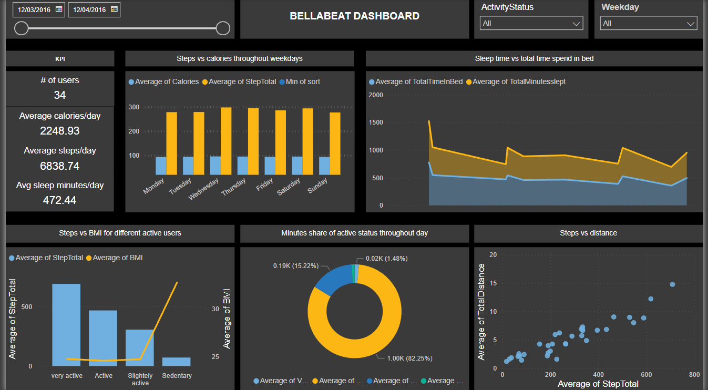

# Bellabeat case study

## Phase 1: Ask - idea of the business requirement
### Business Task
   - Analyze smart device usage data in order to gain insight into how consumers use non-Bellabeat smart devices, then select one Bellabeat product to apply these insights into Bellabeat's marketing strategy.

**Questions for Analysis:**
1. What are some trends in smart device usage?
2. How could these trends apply to Bellabeat customers?
3. How could these trends help influence Bellabeat marketing strategy?

## Phase 2: Prepare - Datasets used
### Prepare
  -This project uses public data to explore the daily habits of smart device users. The dataset, available on Kaggle, includes personal fitness tracker data from thirty Fitbit users who consented to share their minute-level data. This dataset encompasses various metrics such as physical activity, heart rate, and sleep monitoring. It provides detailed information on daily activities, steps taken, and heart rate, offering valuable insights into users’ habits.

Dataset Used: [Link to Dataset](https://www.kaggle.com/datasets/arashnic/fitbit)

This comprehensive dataset allows us to analyze and understand the daily routines and health metrics of individuals using Fitbit devices.

## Phase 3: Process - Process data for analysis
  - For this analysis SQL(Structured Query Language) was used to prepare, process and analyse the available data. PowerBI tool was used for visualtion and to share my findings with stakeholders

1. creating a database bellabeat:
Command used: create database bellabeat;  
2. Imported csv files to databse.
   #### Formatting data
  - Converted columns to correct data types
    
    
    
  - Table minutesleep_merged has information about each minute user slept and each minute they spend time in bed. Calcuting total minutes slept and total time spend in bed by a user on any given day and storing the values in new columns.
    
    
    
  - Checking for any duplicates and removing duplicates
    
   
   
  - Duplicates were found in minutesleep_merged table. Duplicate columns were removed and stored the data in new table sleepday_merged.
  - Creating new base table as hourlydata which will be connected with PowerBI to create an interactive dashboard to present the findings to stakeholders.
    
   
   
  - Inserting values in hourlydata table from different tables.
    
   

   - Inserting more columns in hourlydata table from other tables.
   
     .png)
     .png)
     
   
  - Table hourlysteps_merged contains information about steps of user for every hour of the day. Aggrerating steps to calculate on day to day basis.
   
   
  - Identifying how active they are depending on number of steps taked throughout the day.

    

     - Below is the ERD(Entity relationship diagram) for the schema. Giving an idea about the relationships between different tables used in this analysis.

    

## Phase 4: Analyse the data
   
## Phase 5: Dashboard and Key Findings

-KPI (Key Performance Indicators)

   -Average Calories burned: 2248/day
   
   -Average Steps taken: 6838/day (approximately 5.22km/day) (WHO recommends atleaset 10,000 steps a day to maintin good health)
   
   -Average sleep minutes: 472 minutes/day (approximately 7.8 hours/day)

   
## Phase 6: Act- Recommendations for Bellabeat

   - The analysis indicates that users are most active on Wednesdays, with the highest steps taken and calories burned, while weekends show the lowest activity levels. To enhance overall engagement and balance activity throughout the week, it is recommended to introduce weekend challenges and send personalized notifications to encourage more activity on weekends. These strategies aim to boost user engagement and satisfaction.

   - The graph shows a positive correlation between sleep time and minutes spent in bed. To improve user satisfaction and encourage better sleep habits, we suggest offering personalized sleep insights and tips, implementing features to monitor sleep quality, and sending bedtime reminders to help users maintain consistent sleep schedules. These efforts will aid users in achieving better sleep health and overall well-being.

   - The analysis reveals that users spend an average of 82% of their day in sedentary activities. To mitigate this, we suggest encouraging regular movement breaks, promoting activities to decrease sedentary time, and providing personalized reminders to increase daily activity. These measures will enhance user health and satisfaction.

   - The analysis indicates a positive correlation between the number of steps taken and the total distance covered. To capitalize on this, we suggest implementing step-counting challenges and offering users personalized distance goals to encourage more walking. These approaches will enhance user engagement and satisfaction.
